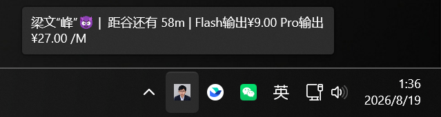
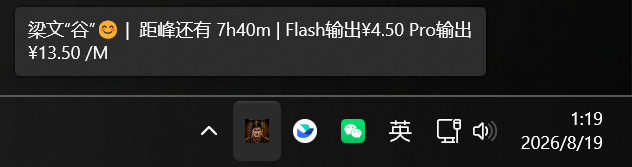
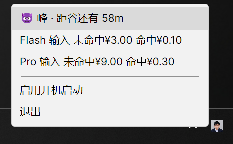
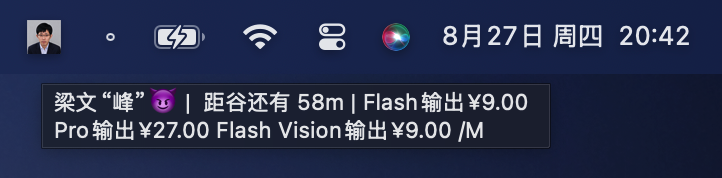
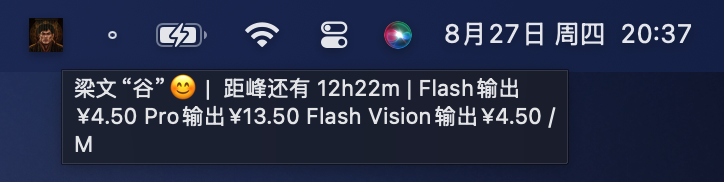
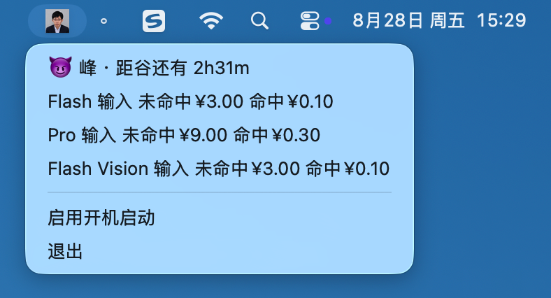

# Liangwengu - 梁文峰？梁文谷！

这是一个 **实时展示 DeepSeek 峰谷价格的系统托盘小程序**，用于随时查看峰谷情况

全部使用 `F#` + `Avalonia.FuncUI` 进行开发，支持 Windows 和 macOS

**效果展示**

| 平台    | 高峰时段                                  | 空闲时段                                    | 右键菜单                                          |
|---------|-------------------------------------------|---------------------------------------------|---------------------------------------------------|
| Windows |  |  |  |
| macOS   |   |   |    |

---

众所周知，自从 DeepSeek V4 Pro 采用峰谷定价后，“梁圣”的口碑会随着峰谷价格呈现一个离散、可归纳的二值化状态：
> 参考 [滑动变祖器](https://liang.itsuyo.top/) 中“小难梁” -> “梁祖”的演化过程

| 定价       | 状态        | 图示                        |
|------------|-------------|-----------------------------|
| 高峰时段   | 😈“梁文峰”  |    |
| 空闲时段   | 😊“梁文谷”  |  |

* 定价和峰谷数据来自 https://api-docs.deepseek.com/zh-cn/quick_start/pricing
  * 通过 LLM 解析官网 HTML 生成 `pricing.json`，程序每 30 min 从 GitHub 拉取最新版本，离线时使用编译期内嵌的兜底数据
* 图片来自 [Abyss-Seeker/liang-intensity-calibrator](https://github.com/Abyss-Seeker/liang-intensity-calibrator/tree/main) 的初始帧和结束帧

## Feature
* 系统托盘根据峰/谷状态自动切换图标"梁文峰"/"梁文谷"（一念神魔）
* 鼠标 hover 托盘图标展示当前峰谷状态 + 价格
* 右键托盘图标查看详细状态、设置开机启动
* 定价数据动态拉取：LLM 解析官网 → GitHub 托管 JSON → 程序每 30 min 自动更新，离线用 bundled 兜底

## Usage

### 系统要求

* Windows：Windows 10 1809（build 10.0.17763）及以上

### 下载安装

去 [Release](https://github.com/Suvern/liangwengu/releases) 页面下载最新的可执行二进制程序

* Windows: 下载 `liangwengu-x.y.z-win-x64.exe` 完成后双击即可运行（推荐将软件放进 `C:\Users\<user-name>]\AppData\Local\` 目录下）

## TODO
- [x] 开机启动
- [x] 从官网定价动态拉取数据而非写死
- [x] macOS 托盘支持
- [ ] 峰谷跳变系统通知提醒
- [ ] 支持更多平台峰谷定价

## Develop
前置需要安装 [.NET 10](https://dotnet.microsoft.com/zh-cn/download) 环境

本项目使用 [just](https://just.systems) 封装所有开发命令（`just --list` 查看全部命令），请预先安装 `just`：

macOS：

```bash
brew install just
```

Windows：

```powershell
winget install Casey.Just
```

> Windows 下 just 依赖 Git for Windows 自带的 `sh` 与 `pwsh`（GitHub Desktop/VS 一般已带），同名 recipe 会通过 `[macos]`/`[windows]` 注解自动选择当前平台。

macOS release/macos 目标还需要安装 workload：

```bash
sudo dotnet workload install macos
```

### 启动项目

`run` 会自动选择当前平台的 target framework：

```bash
just run
```

### 测试

测试项目为 `tests/Liangwengu.Tests/Liangwengu.Tests.fsproj`，包含领域测试和平台相关测试，并支持通用、Windows、macOS 三个 target

运行通用测试：

```bash
just test
```

运行平台相关测试：

```bash
just test-platform
```

### 系统通知测试

系统通知 smoke test 必须运行正式的 apphost，不能使用 xUnit testhost；测试会请求系统发送一条通知，并返回提交结果

```bash
just smoke-test
```

Windows 和 macOS 都需要允许应用发送通知。`Notification submitted successfully.` 只表示系统已接受请求，通知是否可见还取决于系统权限和勿扰模式。

### 代码格式化

项目使用 [Fantomas](https://fsprojects.github.io/fantomas/) 统一 F# 源码格式，首次使用时启用 Commit-Hooks：

```bash
./scripts/install-hooks.sh
```

Windows PowerShell：

```powershell
.\scripts\install-hooks.ps1
```

手动格式化全部 F# 代码，或只检查（与 CI 一致）：

```bash
just format
just format-check
```

### 打包（发布）

**macOS:**
> 产物位于: artifacts/macos-arm64/liangwengu-<version>-macos-arm64.dmg（Intel 则 macos-x64）
```bash
just publish-macos [arch] [version]    # 默认按当前 CPU 推导，version 默认 0.1.0
```

**Windows:**

> 产物位于: artifacts\windows-x64\liangwengu.exe
```powershell
just publish-windows
```

macOS 发布包当前使用 ad-hoc 签名，适合通过 GitHub 分发和测试，但未进行 Apple notarization

首次打开时若被 Gatekeeper 拦截，请在“系统设置 → 隐私与安全性”中允许打开该应用

## License
[MIT](LICENSE)
